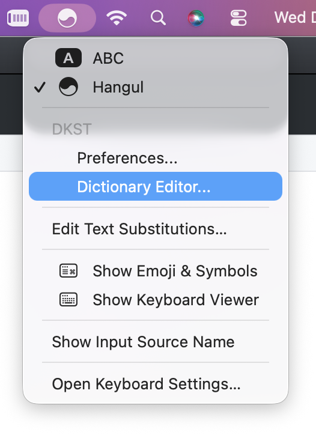
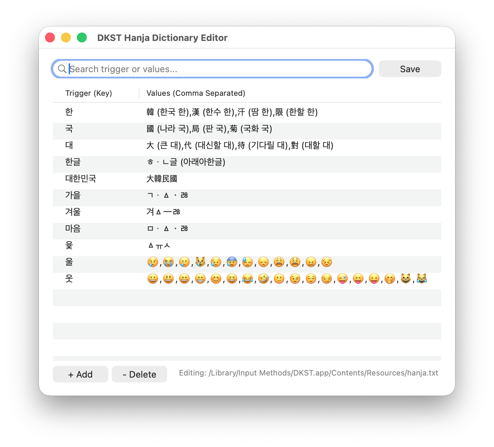
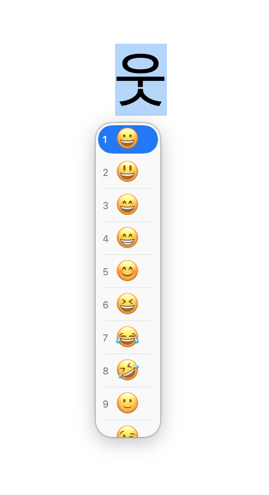

# Dictionary Editor에 관하여
Dictionary Editor는 본래 한자 입력(대치) 기능을 한자 입력보다는 다른 용도로 쓰기 위해 도입되었습니다.
---
## 편집기의 사용방법

  

- DKST 입력기로 변환 된 메뉴바에서 Dictionary Editor를 클릭해 실행할 수 있습니다.

  

- Dictionary Editor는 /Library/Input Methods/DKST.app/Contents/Resources/hanja.txt 또는 ~/Library/Input Methods/DKST.app/Contents/Resources/hanja.txt 을 편집합니다. 편집중인 파일은 하단에 표시됩니다.
- 검색을 통해 이미 입력되어 있는 트리거 글자/단어 또는 값을 검색할 수 있습니다.
- 행의 추가와 삭제는 하단 좌측 +Add 와 -Delete 버튼을 이용하여 할수 있습니다.
- 편집이 끝나면 Save버튼을 눌러 파일을 저장합니다. 그러나 위치의 특성상 관리자 비밀번호 입력 후 저장하며, 사전 데이타의 반영을 위해 DKST를 강제종료 시킵니다. macOS는 사용중인 IME가 종료되면 1~2초 이내에 다시 활성화 시킵니다.

## 한자 입력 기능을 이용한 활용

  

- 트리거에 있는 글자를 입력하고, 커밋이 완료되기 전에 옵션+엔터(우측 쉬프트 위에 위치한)을 눌러 후보창을 띄우고 방향키로 원하는 값으로 이동하여 엔터 또는 스페이스바를 이용해 입력할 수 있습니다. 물론 이 과정은 마우스 커서를 이용할 수도 있습니다.
- 단어의 경우 트리거가 되는 단어를 (블록)선택한 후에 옵션+엔터를 눌러 위와 동일한 방법으로 사용합니다. 
