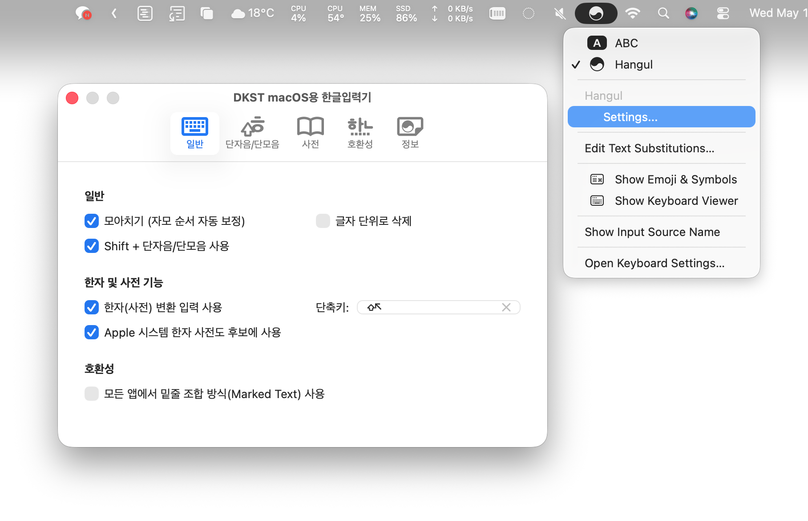

# macOS용 DKST 한글입력기 환경설정 설명

> DKST macOS용 한글입력기 설정이 개편되었습니다.  
> 이제 사전 편집기는 설정에서 관리할 수 있습니다.

## 일반

### 일반

* **모아치기 (자모 순서 자동 보정)**: 자음과 모음의 입력 순서에 상관없이 글자를 완성하는 옵션입니다. 빠르게 타이핑할때 오타를 줄일 수 있습니다.

  > 사용예시: `ㅏ` + `ㄱ` = `가`
  
* **쉬프트키 + 단자음/단모음 사용자화 사용**: 단자음/단모음에 `Shift`를 이용해서 입력할 때 정의 된 출력 내용을 대신 입력합니다.

  >사용 예시: `Shift` + `ㅇ` = `안녕하세요` * 주의: 단축키에 영향이 있을 수 있습니다.
  
* **글자 단위로 삭제**: 입력 중인 글자를 자소 단위로 삭제할지 글자를 한번에 삭제할지 이 옵션을 통해 선택할 수 있습니다.

### 한자 및 사전 기능

* **한자(사전) 변환 입력 사용**: 입력하거나 선택한 글자와 연결 된 사전을 불러 옵니다. [사전](DICT-EDIT.md) 기능을 사용하기 위해서는 `✓` 상태여야 합니다.

* **Apple 시스템 한자 사전도 후보에 사용**: macOS에서 내장되어 있는 한자 사전도 사전 변환시 조회할지 선택하는 옵션입니다. 사용자 정의 된 사전만 사용하고자 할 경우에는 이 옵션을 해제하세요.

### 호환성

* **모든 앱에서 밑줄 조합 방식 사용**: 모든 입력에서 직접 입력 대신 `Marked Text`(입력 중인 글자에 밑줄) 조합을 이용해 입력 안정성을 높입니다. 과거 Mac OS X 에서 일반적으로 사용되던 한글 입력 방식이지만, 커밋 전 밑줄이 붙은 글자로 인해 불편한 상황이 발생할 수 있습니다.

## 단자음/단모음

* `Shift 키`와 단자음/단모음 조합시 입력 될 값을 설정합니다. 비어 있는 칸은 작동하지 않습니다.
*  사용할 Shift + `키` 의 출력내용에 원하는 입력 값을 설정하세요.

## 사전

[사전](DICT-EDIT.md) 기능 문서를 확인하세요.

## 호환성

DKST macOS 한글입력기는 다양한 앱에서 `직접 입력` 또는 `밑줄 조합 방식` 을 스스로 판단하지만, 복잡하게 차별화 되어 개발된 앱의 텍스트 입력창에서는 올바르게 작동하지 않을 수 있습니다. 이 경우 해당 앱을 `밑줄 조합 방식으로 사용할 앱 Bundle ID`에 추가하여 한글 입력 호환성을 개선할 수 있습니다.

* **밑줄 조합 방식으로 사용할 앱 Bundle ID**: `모든 앱에서 밑줄 조합 방식 사용`이 꺼있어도 여기에 추가 된 앱은 **항상 밑줄 조합 방식으로 입력**합니다..

## 정보

* **입력기 버젼**: 설치 되어 있는 DKST macOS용 한글입력기 버젼이 표시 됩니다.

* **환경설정 버젼**: 설치 되어 있는 DKST macOS용 한글입력기 설정 버젼이 표시 됩니다.
