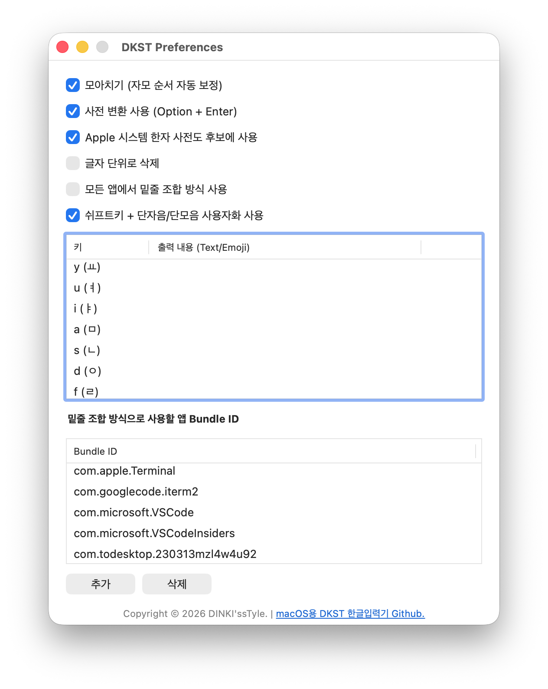

# macOS용 DKST 한글입력기 환경설정 설명

* **모아치기 (자모 순서 자동 보정)**: 자음과 모음의 입력 순서에 상관없이 글자를 완성하는 옵션입니다. 빠르게 타이핑할때 오타를 줄일 수 있습니다.

  > 사용예시: `ㅏ` + `ㄱ` = `가`

* **사전 변환 사용 (Option + Enter)**: 입력하거나 선택한 글자와 연결 된 사전을 불러 옵니다. [Dictionary Editor](Dict_edit.md) 기능을 사용하기 위해서는 `✓` 상태여야 합니다.

* **Apple 시스템 한자 사전도 후보에 사용**: macOS에서 내장되어 있는 한자 사전도 사전 변환시 조회할지 선택하는 옵션입니다. 사용자 정의 된 사전만 사용하고자 할 경우에는 이 옵션을 해제하세요.

* **글자 단위로 삭제**: 입력 중인 글자를 자소 단위로 삭제할지 글자를 한번에 삭제할지 이 옵션을 통해 선택할 수 있습니다.

* **모든 앱에서 밑줄 조합 방식 사용**: 모든 입력에서 직접 입력대신 `Marked Text`(입력중인 글자에 밑줄) 조합을 이용해 입력 안정성을 높입니다. Mac OS X에서 과거에는 일반적인 한글 입력 방식입니다. 그러나 커밋전 밑줄쳐진 글자로 인해 거슬리는 상황들이 발생합니다.

* **밑줄 조합 방식으로 사용할 앱 Bundle ID**: `모든 앱에서 밑줄 조합 방식 사용`이 꺼있어도 여기에 추가 된 앱은 **항상 밑줄 조합 방식으로 입력**합니다..

* **쉬프트키 + 단자음/단모음 사용자화 사용**: 단자음/단모음에 `Shift`를 이용해서 입력할 때 정의 된 출력 내용을 대신 입력합니다.

  >사용 예시: `Shift` + `ㅁ` = `안녕하세요` * 주의: 단축키에 영향이 있을 수 있습니다.