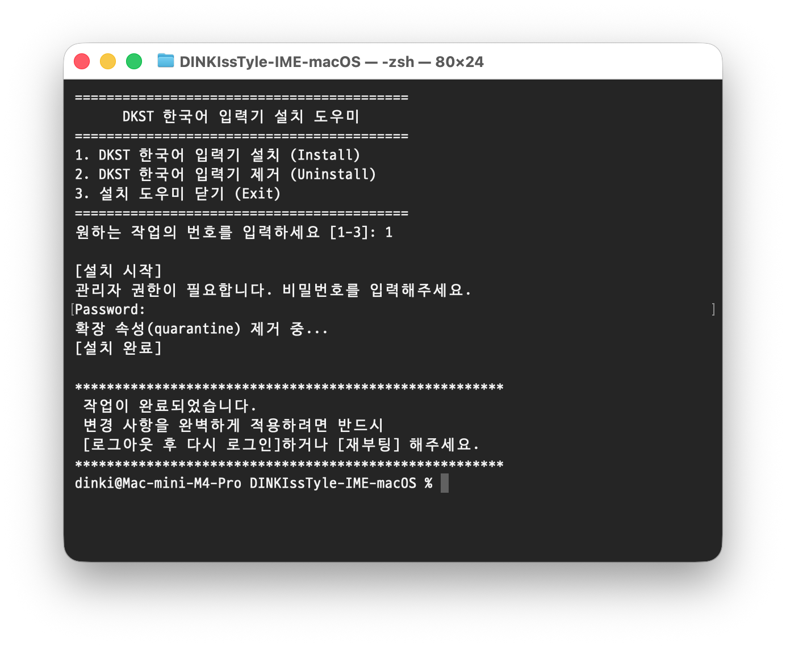

  

애플실리콘 맥용 간단한 macOS용 한글입력기
ㅏ ㄱ = 가 와 같은 모아치기 기능이 탑재되어 있습니다.

***이 프로젝트의 기본적인 한국어 입력기 구조는 바람입력기를 참고해서 작성되었습니다.***
***https://baramim.blogspot.com/***

**설치방법**

  

- 저장소를 다운로드 하세요.
- 터미널을 이용 install.sh 에 실행권한을 주세요.
- chmod +x install.sh
- 터미널에서 install.sh 를 실행합니다.
