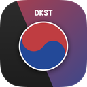

<p align="center">
  
</p>

<p align="center">
  
</p>

macOS용 DKST 한글입력기  
macOS 10.15 Catalina+  
Universal Binary  


---

**소소하지만 기능**
- macOS의 기본 다크/라이트 모드 변경을 지원하는 PDF 메뉴바 아이콘
- 사전 입력 지원
- 사전 편집기 제공 ✨
- 사전 입력, 편집 그리고 기능에 관해서 Dict_edit.md 문서를 확인해주세요.  
- 모아치기 옵션 지원 (예: ㅏ -> ㄱ = 가)
- 단모음/단자음을 쉬프트키로 입력시 커스텀 문구나 이모지 등을 등록가능 (예: 쉬프트 + ㅇ = 안녕하세요)
- 백스페이스로 삭제시 조합이 끝나지 않은 경우에도 한글자씩 제거하는 옵션이 있습니다.
- Mac의 전통적인 특문이 입력됩니다. 옵션 또는 옵션+쉬프트 입력시
- 기타 앱에서 한글이 단축키를 가로채지 않도록 합니다.


**설치 방법**
1. 터미널을 엽니다.
2. 아래 코드를 복사해서 붙여넣고 실행합니다.
```
/bin/bash -c "$(curl -fsSL https://raw.githubusercontent.com/DINKIssTyle/DINKIssTyle-IME-macOS/main/install.sh)"
```
